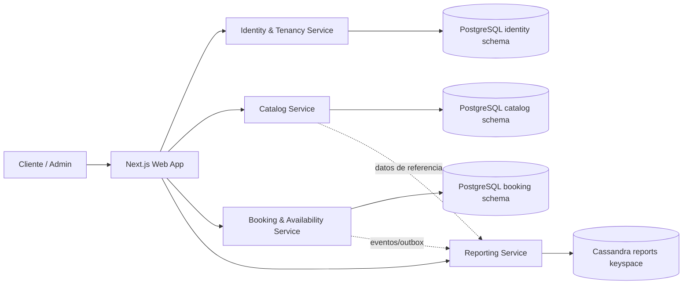
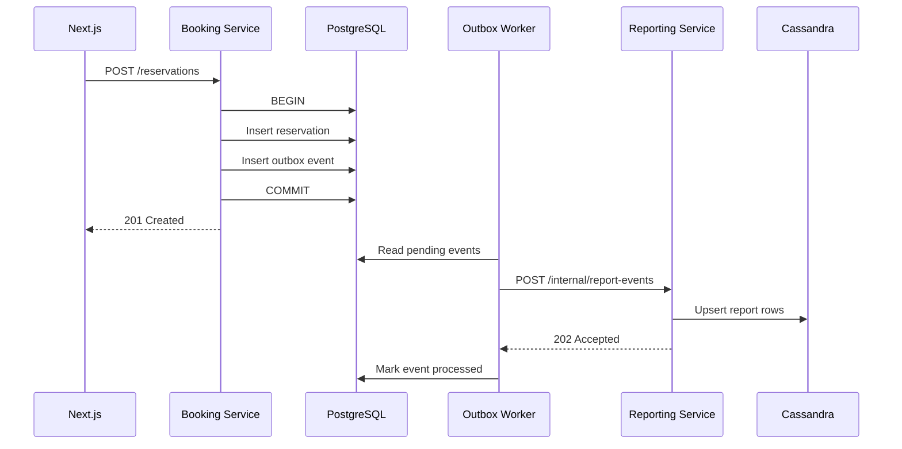

# Arquitectura del MVP con microservicios

Este MVP usa microservicios solo donde tiene sentido. La meta no es parecer enterprise, sino separar responsabilidades reales y dejar claro qué servicio toca qué datos.

## Vista general

## Cantidad de microservicios

Tendremos 4 microservicios:

1. Identity & Tenancy Service.
2. Catalog Service.
3. Booking & Availability Service.
4. Reporting Service.

## Decisión de bases de datos

### PostgreSQL para operación

PostgreSQL será usado por los servicios transaccionales:

- Identity & Tenancy.
- Catalog.
- Booking & Availability.

Motivo:

- Necesitamos transacciones.
- Necesitamos relaciones claras.
- Necesitamos integridad de datos.
- Necesitamos evitar doble reserva con restricciones fuertes.
- El MVP se programa más rápido y con menos riesgo.

Para MVP local se puede usar una sola instancia de PostgreSQL con esquemas separados:

- `identity`
- `catalog`
- `booking`

Cada servicio solo debe escribir en su propio esquema. Si necesita datos de otro dominio, debe consultarlo por API o recibir una copia mínima por evento.

### Cassandra para reportes

Cassandra será usada únicamente por Reporting Service.

Motivo:

- Los reportes se consultan por tenant, sucursal, fecha, servicio, recurso y estado.
- Conviene tener tablas ya preparadas para lectura.
- No queremos que los reportes pesados afecten la base transaccional.
- Cassandra es buena para escrituras altas y lecturas por clave/partición bien diseñada.

## 1. Identity & Tenancy Service

### Responsabilidades

- Registro/login.
- Usuarios.
- Roles.
- Empresas/tenants.
- JWT.
- Validación de permisos básicos.

Los usuarios internos pertenecen a un tenant. Los usuarios con rol `client` son
globales, tienen `tenant_id = NULL` y seleccionan el negocio al consultar catálogo
o crear una reserva.

Todos los microservicios validan firma, issuer, audience y expiración del JWT.
Catalog, Booking y Reporting consultan además `GET /auth/me` en Identity para
rechazar inmediatamente usuarios bloqueados/inactivos o tokens con roles obsoletos.

### Base de datos

PostgreSQL, esquema `identity`.

### No hace

- No administra servicios ni recursos.
- No calcula disponibilidad.
- No crea reservas.
- No genera reportes.

### Entidades principales

- Tenant.
- User.
- Role.
- UserRole.
- UserBranchAccess.

### Endpoints principales

- `POST /auth/login`
- `POST /auth/register-client`
- `GET /auth/me`
- `POST /tenants`
- `GET /tenants/public`
- `POST /users/admin`
- `GET /users`
- `GET /users/{userId}`
- `PUT /users/{userId}`
- `PATCH /users/{userId}/status`
- `DELETE /users/{userId}`
- `PUT /users/me`
- `PATCH /users/me/password`

## 2. Catalog Service

### Responsabilidades

- Sucursales.
- Servicios.
- Recursos reservables.
- Asociación servicio-sucursal.
- Asociación servicio-recurso.
- Horarios base.
- Estado de recurso: `active`, `blocked`, `inactive`.

### Base de datos

PostgreSQL, esquema `catalog`.

### No hace

- No confirma reservas.
- No decide conflictos finales de concurrencia.
- No genera reportes finales.

### Entidades principales

- Branch.
- Service.
- Resource.
- BranchService.
- ServiceResource.
- ResourceSchedule.

### Endpoints principales

- `GET /public/tenants/{tenantSlug}/branches`
- `GET /public/tenants/{tenantSlug}/services`
- `POST /branches`
- `PUT /branches/{branchId}`
- `POST /services`
- `PUT /services/{serviceId}`
- `POST /resources`
- `PUT /resources/{resourceId}`
- `POST /resource-schedules`

## 3. Booking & Availability Service

### Responsabilidades

- Consulta de disponibilidad.
- Creación de reservas.
- Cancelación simple.
- Bloqueos manuales.
- Agenda administrativa.
- Historial de reserva.
- Emisión de eventos para reportes.

### Base de datos

PostgreSQL, esquema `booking`.

### No hace

- No administra usuarios.
- No administra catálogo maestro.
- No calcula reportes pesados.

### Entidades principales

- Reservation.
- ReservationHistory.
- ResourceBlock.
- ReservationEventOutbox.

### Regla crítica de concurrencia

La prevención de doble reserva se resuelve en PostgreSQL usando una restricción de solapamiento por recurso y rango horario.

Recomendado:

- Usar `tstzrange(start_at, end_at)`.
- Usar extensión `btree_gist`.
- Crear `EXCLUDE CONSTRAINT` para evitar rangos solapados por `tenant_id`, `resource_id` y tiempo.
- Aplicar la restricción solo para reservas activas y bloqueos activos.

Si dos usuarios intentan reservar el mismo recurso a la misma hora, la base de datos debe impedir que ambas reservas queden confirmadas.

## 4. Reporting Service

### Responsabilidades

- Recibir eventos de reservas, cancelaciones, atención, no-show y bloqueos.
- Guardar datos agregados/desnormalizados en Cassandra.
- Exponer endpoints de reportes rápidos.
- No bloquear el flujo principal de reservas.

### Base de datos

Cassandra, keyspace `reservas_reports`.

### No hace

- No crea reservas.
- No cambia estados de reserva.
- No valida disponibilidad.
- No maneja autenticación propia más allá de validar JWT.

### Reportes útiles del MVP

- Resumen diario por tenant.
- Reservas por sucursal y fecha.
- Reservas por servicio y mes.
- Ocupación por recurso y día.
- Cancelaciones y no-shows por período.
- Horas pico por sucursal.

### Consistencia esperada

Los reportes pueden tener consistencia eventual.

Ejemplo: si se crea una reserva, la reserva ya existe en PostgreSQL inmediatamente, pero el reporte en Cassandra puede actualizarse unos segundos después. Esto está bien para MVP.

## Comunicación entre Booking y Reporting

Para no meter Kafka ni RabbitMQ en el MVP, se recomienda este flujo simple:

1. Booking crea/cancela/actualiza una reserva en PostgreSQL.
2. En la misma transacción, Booking guarda un registro en `booking.reservation_event_outbox`.
3. Un background worker de Booking lee eventos pendientes y llama a Reporting Service por REST.
4. Reporting guarda/agrega datos en Cassandra.
5. Booking marca el evento como procesado.

Esto evita perder eventos si Reporting está caído temporalmente.

## Diagrama de eventos

