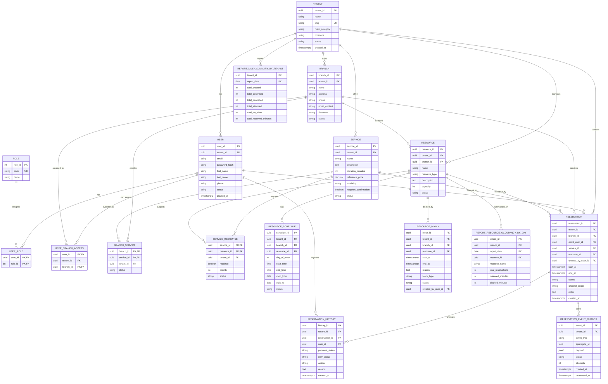

# Diagrama entidad-relación Mermaid

Este diagrama representa el modelo conceptual/lógico del MVP actualizado.

Importante:

- La operación principal vive en PostgreSQL.
- Reporting vive en Cassandra.
- Cassandra no tiene relaciones reales ni foreign keys; se muestra aparte como modelo de lectura para reportes.

